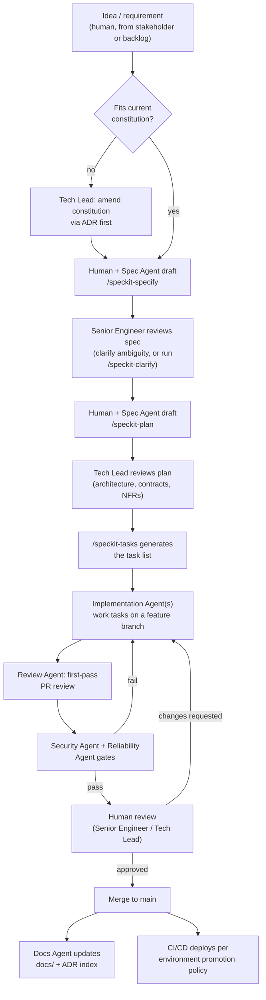

# Contributing — Change Process

This repo is built by a hybrid pod: 2-3 human engineers plus the agents in
[`AGENTS.md`](AGENTS.md), governed by
[`.specify/memory/constitution.md`](.specify/memory/constitution.md). This
document is the operational "how a change actually happens" — read the
constitution first if you haven't; this assumes it.

## Toolchain
- **Spec-kit** (GitHub Spec Kit, `specify` CLI) drives the spec → plan →
  tasks → implement flow, installed as Claude Code skills under
  `.claude/skills/speckit-*`.
- **Maven** (Java 17) builds the code — `mvn -B verify` from the repo root
  builds and tests every module.
- **Spring Cloud Config** (`config-server` module + `config-repo/`) is the
  config backplane, including a fully offline `native`/local mode.

## The flow



## Gates a change cannot skip

1. **Constitution conformance** — automatic check + human spot-check.
2. **Human spec approval** before any code is written.
3. **Tech Lead plan approval** before tasks are generated — this is where
   contract/schema/NFR decisions get caught, deliberately before any code
   exists.
4. **Automated gates** (build, tests, security scan, perf budget) before
   human code review — this is what the Review/Security/Reliability agents
   are for: don't spend human review time on what a machine can catch.
5. **Human merge authority, always.** No agent has merge rights to `main`.
6. **Emergency carve-out**: an incident-driven change may bypass gate
   ordering 2-4, but must be retro'd into a spec within 48 hours and
   approved by the Tech Lead.

## Starting a new feature

```bash
# 1. Draft the spec (interactive — answers your clarifying questions)
#    In a Claude Code session in this repo:
/speckit-specify <plain-language description of the feature>

# 2. Optional: de-risk ambiguous areas before planning
/speckit-clarify

# 3. Draft the implementation plan (Tech Lead reviews before proceeding)
/speckit-plan

# 4. Optional: generate a requirements-completeness checklist
/speckit-checklist

# 5. Generate the task list
/speckit-tasks

# 6. Optional: cross-artifact consistency check before implementing
/speckit-analyze

# 7. Implement (Implementation Agent works tasks; opens a PR)
/speckit-implement
```

Each numbered feature gets its own directory under `.specify/specs/` (spec-
kit manages the numbering/branching for you).

## Local development

```bash
# Whole stack (config-server + kafka + redis + platform-service), fully offline
docker compose -f deploy/docker/docker-compose.yml up --build

# Or just the app, against its offline fallback defaults, no other services required
mvn -pl platform-service spring-boot:run -Dspring-boot.run.profiles=local

# Build + test everything
mvn -B verify
```

## Definition of Done

spec approved → plan approved → tests written first or alongside → CI green
(unit, contract, integration) → security scan clean → reliability check
(load/latency budget) not regressed → docs updated → human-approved merge.
