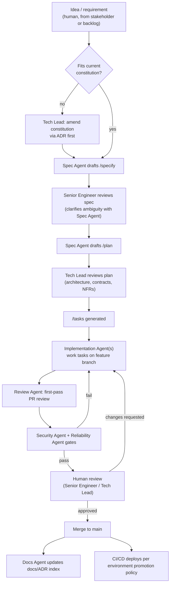

# Hybrid Pod Platform — Spec-Kit Constitution & Initial Brief (DRAFT FOR REVIEW)

> Status: **draft, not yet applied**. Nothing has been scaffolded. Once you sign off (or edit inline), this becomes the input to `specify init` (Part A → `/constitution`) and the first `/specify` run (Part B).
>
> Scope of this platform: a Java, container-orchestrator-agnostic service that exposes **omni-channel ingress APIs** and **legacy-integration egress APIs**, built and operated by a **hybrid pod** (2–3 human engineers + coding agents), targeting **99.999% availability**.

---

## How to use this document

1. Review Parts A–E below. Edit inline or leave comments per section.
2. Part A becomes `.specify/memory/constitution.md` (or run `/constitution` with it as input) — it governs every future spec/plan/task in this repo and is checked on every PR.
3. Part B becomes the first `/specify` prompt — it establishes the platform skeleton (gateway, config harness, persistence harness) as the foundation everything else builds on.
4. Part C is not a spec-kit artifact — it's the agent operating manual, kept as `AGENTS.md` + per-agent config files, referenced by the constitution.
5. Part D is the process doc — becomes `CONTRIBUTING.md` / `docs/change-process.md`.
6. Part E is the proposed repo layout, applied once A–D are approved.
7. Part F lists decisions I need from you before scaffolding.

---

## PART A — Constitution (`/constitution` input)

### A.1 Mission
Provide a highly available integration platform that accepts requests from any channel (web, mobile, partner API, batch/file, messaging/event) and reliably bridges them to legacy back-end systems, without the caller or the legacy system needing to know about each other's protocols, formats, or availability characteristics.

### A.2 Operating model
This repository is built by a **hybrid pod**:

| Role | Who | Owns |
|---|---|---|
| Tech Lead / Architect | Human | Architecture decisions, ADRs, irreversible choices (schema, contracts, infra topology), final merge authority on `main` |
| Senior Engineer(s) (1–2) | Human | Spec authorship/approval, plan review, hard debugging, cross-system integration, agent output review |
| Spec Agent | Agent | Drafts `/specify` and `/plan` content from human intent, flags ambiguity instead of guessing |
| Implementation Agent(s) | Agent | Turns approved `/tasks` into code + tests on feature branches |
| Review Agent | Agent | First-pass PR review (style, test coverage, spec conformance) before human review |
| Security Agent | Agent | SAST/dependency/secret scanning, threat-modeling checklist on every PR touching ingress/egress/auth |
| Reliability Agent | Agent | Owns NFR conformance — load test thresholds, chaos test hooks, SLO burn-rate checks |
| Docs Agent | Agent | Keeps README, API docs (OpenAPI/AsyncAPI), and ADR index in sync with merged code |

No agent merges to `main` unafffected by human review. Agents may open PRs, run in CI, and comment; only a human (Tech Lead or delegated Senior Engineer) approves and merges.

### A.3 Non-negotiable principles
1. **Spec before code.** No implementation task exists without an approved spec + plan. Agents that receive ambiguous instructions must produce clarifying questions, not assumptions.
2. **Container/orchestrator agnostic.** No code, config, or health-check logic may hard-depend on Kubernetes, ECS, Nomad, etc. Packaging target is an OCI image + a 12-factor config contract. Orchestrator-specific manifests (Helm/K8s YAML, ECS task defs) live in `deploy/<target>/` as optional, swappable adapters — never in application code.
3. **Config and secrets are externalized.** No environment-specific value is compiled into an artifact. Spring Cloud Config is the config backplane; secrets never enter Config Server plaintext (see Part B.4).
4. **Contracts are versioned and backward compatible by default.** Ingress and egress contracts (OpenAPI/AsyncAPI/schema) are versioned; breaking changes require an explicit ADR and a deprecation window.
5. **Every ingress/egress boundary is an anti-corruption layer.** Legacy protocols/formats never leak into the domain model; channel-specific formats never leak past the ingress adapter.
6. **Observability is part of "done."** No PR merges without structured logs, metrics (RED/USE), and distributed tracing propagation for anything on the request path.
7. **Resilience is explicit, not assumed.** Every egress call declares a timeout, retry policy, and circuit breaker. Silent unbounded calls to legacy systems are a defect, not a style choice.
8. **Definition of Done** for any change: spec approved → plan approved → tests written first or alongside → CI green (unit, contract, integration) → security scan clean → reliability check (load/latency budget) not regressed → docs updated → human-approved merge.
9. **Agents operate under least privilege.** Each agent's tool/action permissions are scoped to its role (Part C) and logged. No agent has standing production credentials.
10. **Reversible by default.** Prefer additive migrations, feature flags, and blue/green-compatible changes over destructive/irreversible ones; irreversible changes require Tech Lead sign-off via ADR.

### A.4 Decision rights & escalation
- **Agent can decide alone:** implementation details within an approved plan/task (variable names, internal method structure, test cases beyond the minimum specified).
- **Agent must ask a human:** anything touching public contract shape, data schema, security posture, dependency additions, or NFR thresholds.
- **Only Tech Lead decides:** architecture pattern changes, new external dependencies with licensing/cost implications, irreversible data migrations, incident-driven emergency changes that bypass normal flow (must be retro'd within 48h).

---

## PART B — Platform Brief (`/specify` input #1: the foundation)

### B.1 System context
```
[Omni-channel callers]                                   [Legacy back ends]
  Web/Mobile clients  \                                  / Mainframe (fixed-width, MQ)
  Partner REST/webhook -> [Ingress layer] -> [Core domain] -> [Egress layer] -> SOAP service
  Batch/file drop      /        |                              \ Proprietary TCP/legacy DB
  Event/queue                  v
                        [Config + Persistence Harness]
                        (Spring Cloud Config, local store)
```

### B.2 Functional scope (v1)
- **Ingress adapters**, one per channel family, normalizing to a single internal Command/Event model:
  - REST/JSON (synchronous, public + partner)
  - Webhook receiver (async, verified signatures)
  - Messaging/event consumer (e.g., Kafka/JMS-agnostic — abstracted behind a `MessageInbound` port)
  - Batch/file ingest (scheduled or triggered)
- **Core domain layer**: channel-agnostic orchestration, validation, idempotency, business rules. No channel or legacy-protocol type ever appears here.
- **Egress adapters**, one per legacy target, translating internal Command/Event into the legacy protocol:
  - SOAP/XML adapter
  - Fixed-width/mainframe file or MQ adapter
  - Legacy REST/DB adapter
  - Each egress adapter implements a common `LegacyGatewayPort` interface so new legacy targets are additive, not invasive.
- **Idempotency & correlation**: every inbound request gets a correlation ID; duplicate ingress (channel retries) must not double-execute egress calls.

### B.3 Non-functional requirements (5 nines)
- **Availability target:** 99.999% (≈5.26 min/year downtime budget) for the ingress→core path. State explicitly which components share this SLO vs. have a looser one (e.g., batch ingest can be 99.9%) — **needs your input, see Part F**.
- **Latency budget:** p99 ingress response time target — placeholder 300ms synchronous, needs your number.
- **Resilience patterns required on every egress call:** timeout, bounded retry with backoff + jitter, circuit breaker, bulkhead/connection-pool isolation per legacy target (one flaky legacy system must not starve others).
- **Statelessness:** application nodes are stateless; all durable state lives in the persistence harness (B.5) so horizontal scaling and rolling/zero-downtime deploys work regardless of orchestrator.
- **Multi-instance by default:** no in-memory-only state that breaks under >1 replica (sessions, caches, dedupe keys all externalized or replicated).
- **Graceful degradation:** if a legacy egress target is down, ingress still accepts and durably queues/persists the request (outbox pattern) rather than failing the caller, where the domain allows async settlement.
- **Disaster recovery:** RPO/RTO targets — needs your input.

### B.4 Configuration harness
- **Spring Cloud Config Server** as the config backplane, backed by a Git repo (config repo separate from code repo) for versioned, auditable config.
- **Local/offline mode:** a `native` profile (Spring Cloud Config `native` backend reading local filesystem) so the service and each agent's dev loop work without network access to a live Config Server — this satisfies "local workload persistence for configuration."
- **Secrets:** never stored in the config repo in plaintext. Config Server resolves secret placeholders from an externalized secret store abstraction (Vault, cloud KMS/secrets manager, or local `.env`/encrypted file for dev) — kept behind a `SecretStore` interface so the platform stays provider-agnostic (mirrors the pattern already used in the [Intent Classifier project](../../../.claude/projects/-Users-garymoyer-connect-chat/memory/project_intent_classifier_java.md)'s `ConfigStore`/`SecretStore` abstraction — worth reusing here for consistency if that's the same team/estate).
- **Config refresh:** `/actuator/refresh` or Spring Cloud Bus for rolling refresh without redeploy, orchestrator-agnostic.

### B.5 Local persistence harness
- **Dev/local store:** embedded/local-mode datastore (e.g., Postgres via Testcontainers for parity, or H2/embedded for pure offline dev) so agents and engineers can run the full stack with `docker compose up` or equivalent with zero cloud dependencies.
- **Production store:** interface-driven (`ConfigStore`/`StatePort` style abstractions) so the concrete datastore (Postgres, DynamoDB, Cosmos, etc.) is swappable per deployment target — keeps the "container agnostic" principle extended to "datastore agnostic at the port level."
- **What lives here:** idempotency keys/dedupe records, outbox events for async egress, correlation/audit trail, circuit-breaker state if not in-memory-per-node.
- **Cache tier (optional, needs your input):** Redis or equivalent for hot dedupe-key lookups and rate-limit counters, behind a `CachePort` so it can be swapped or removed.

### B.6 Explicitly out of scope for v1
- Specific channel implementations beyond the four families above (added later via their own `/specify` runs).
- Specific legacy protocol adapters beyond the three families above.
- UI/front-end — this is a backend integration platform only.
- Multi-region active-active (assume single-region multi-AZ unless Part F says otherwise).

---

## PART C — Agent Roster & Configuration

Each agent gets its own config file (`agents/<name>.md` or your harness's native format) with: role, system prompt, allowed tools, guardrails, escalation triggers, and model tier. Summary:

| Agent | Primary input | Primary output | Allowed actions | Forbidden actions | Escalates when |
|---|---|---|---|---|---|
| **Spec Agent** | Human intent, existing specs | `/specify` + `/plan` drafts | Read repo, read constitution, draft markdown | Write application code, merge anything | Requirement is ambiguous or conflicts with constitution |
| **Implementation Agent** | Approved `/tasks` | Code + unit/contract tests on a feature branch | Write code/tests in scoped paths, run local build/test | Modify public contracts, add dependencies, touch `deploy/` or config-repo secrets | Task requires a contract change or new dependency not in the plan |
| **Review Agent** | Open PR diff | Inline review comments, pass/fail gate | Read diff, run static analysis, comment | Approve/merge, modify code | Finds a security or NFR-relevant issue → routes to Security/Reliability Agent + human |
| **Security Agent** | PR diff touching ingress/egress/auth | SAST/dependency/secret scan report, threat-model checklist | Run scanners, comment, block merge on critical finding | Suppress/waive a finding | Any critical/high finding, or new external dependency |
| **Reliability Agent** | PR diff + perf test results | SLO/latency-budget conformance report | Run load/perf tests in CI, compare to budget | Change the budget itself | Regression beyond threshold, or missing resilience annotation (no timeout/retry/breaker) on new egress call |
| **Docs Agent** | Merged PRs | Updated README/OpenAPI/AsyncAPI/ADR index | Write to `docs/`, generate API docs from code annotations | Change behavior-defining code | Docs would contradict actual behavior (signals a spec/code drift bug) |

### C.1 Guardrails common to all agents
- Every agent runs with a **scoped, logged identity** (e.g., a distinct CI bot token/service account per agent role) — never a shared "agents" credential and never a human's personal credentials.
- Every agent's output is traceable to the spec/task ID that authorized it (commit messages/PR descriptions reference the spec-kit task ID).
- Any agent hitting an ambiguity, missing NFR number, or constitution conflict **stops and asks** rather than assuming a default.
- Model tier suggestion: Spec/Review/Docs agents can run on a lighter/cheaper model tier; Implementation and Security agents on your strongest available tier given they touch code correctness and vulnerability judgment.

### C.2 Where this lives in the repo
```
AGENTS.md                 # index + shared guardrails (Part C.1)
agents/spec-agent.md
agents/implementation-agent.md
agents/review-agent.md
agents/security-agent.md
agents/reliability-agent.md
agents/docs-agent.md
```

---

## PART D — Change Process (spec-kit flow mapped to the pod)



**Key gates a change cannot skip:**
1. Constitution conformance (automatic check + human spot-check).
2. Spec approval by a human before any code is written.
3. Plan approval by Tech Lead before tasks are generated (this is where contract/schema/NFR decisions get caught).
4. Automated gates (build, tests, security scan, perf budget) before human code review — agents shouldn't spend human review time on things a machine can catch.
5. Human merge authority always — no agent has merge rights to `main`.
6. Emergency/incident changes may bypass step 2–4 ordering but must be retro'd into a spec within 48 hours (Part A.4).

---

## PART E — Proposed repo layout (applied after sign-off)

```
.
├── .specify/                     # spec-kit state (constitution, specs, plans, tasks)
├── AGENTS.md
├── agents/                       # per-agent config (Part C.2)
├── docs/
│   ├── adr/                      # architecture decision records
│   └── api/                      # generated OpenAPI/AsyncAPI docs
├── config-repo/                  # Spring Cloud Config native backend (local mode)
│   └── application.yml, <service>-<profile>.yml
├── deploy/
│   ├── docker/                   # Dockerfile, docker-compose for local stack
│   ├── k8s/                      # optional, swappable
│   └── ecs/                      # optional, swappable
├── src/main/java/.../
│   ├── ingress/                  # per-channel adapters
│   ├── domain/                   # channel/legacy-agnostic core
│   ├── egress/                   # per-legacy-target adapters
│   ├── config/                   # ConfigStore/SecretStore abstractions
│   └── persistence/              # StatePort/CachePort abstractions + impls
├── src/test/java/.../
│   ├── unit/
│   ├── contract/                 # consumer-driven contract tests per adapter
│   └── integration/              # Testcontainers-based, full local stack
├── build.gradle (or pom.xml)
└── CONTRIBUTING.md                # Part D, human-readable
```

---

## PART F — Decisions needed from you before I scaffold

1. **Build tool:** Gradle or Maven?
2. **Messaging tech for the event-ingress family:** Kafka, JMS/ActiveMQ/RabbitMQ, or "abstract only, pick later"?
3. **Concrete availability/latency numbers:** confirm 99.999% applies to the whole ingress→egress path, or only ingress-accept; give a p99 latency target.
4. **DR posture:** RPO/RTO, single-region-multi-AZ vs. multi-region.
5. **Local dev datastore:** Postgres via Testcontainers, or plain embedded H2, or both (H2 for fast unit loop, Testcontainers-Postgres for integration)?
6. **Cache tier:** include Redis-backed `CachePort` now, or stub the interface and defer the implementation?
7. **Relationship to the existing [Intent Classifier / Java conversion](../../../.claude/projects/-Users-garymoyer-connect-chat/memory/project_intent_classifier_java.md) project:** is this the same service estate (reuse its `ConfigStore`/`SecretStore` abstractions directly) or a separate platform that should just follow the same pattern independently?
8. **CI/CD platform:** GitHub Actions assumed (you said GitHub Spec Kit) — confirm, and confirm whether this repo is going to actually live on GitHub now (current directory isn't a git repo yet).
9. **Agent execution environment:** are these agents literally Claude Code sessions/subagents wired into CI (e.g., via `claude` CLI in GitHub Actions), or a different agent framework? This determines exactly how `agents/*.md` gets wired to something that executes.

Once you answer Part F (or tell me to use sensible defaults), I'll `git init`, scaffold Part E, apply Part A as the actual spec-kit constitution, and run the first `/specify` from Part B.
